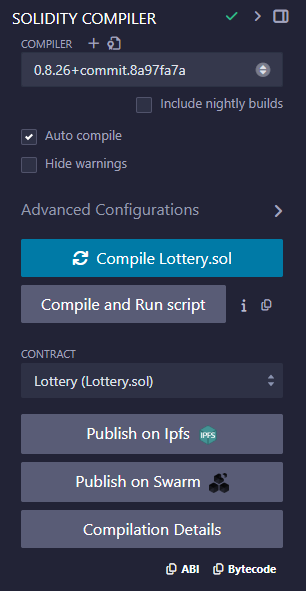

#### Important Note!
```sh
This contract for testing only Random SHA3 not best praction to use for prodction Enviroment
This code contain transfer crypto currency on wallet make sure to verify funtion before compile
```

#### Install
```sh
npm install
```
#### env 
```sh
MENOMONIC : wallet menomonic keep is secrect donot let anyone know
INFURA_URL: Infura rpc url
```

#### Test
```sh
npm run test
```
####  Deploy 
```sh
node deploy.js
```

####  Release Note:
```sh
 "dependencies": {
    "@truffle/hdwallet-provider": "^2.1.15",
    "dotenv": "^16.4.5",
    "ganache": "^7.9.2",
    "mocha": "^10.5.2",
    "solc": "^0.8.19",
    "web3": "^4.10.0"
  }
```

Sampel contract Deploy at:
 ```sh 
https://sepolia.etherscan.io/address/0xd1ebd47ff18cc96f70dc01a51d1b1a3e8f133b87
 ```

Remix
https://remix.ethereum.org/


